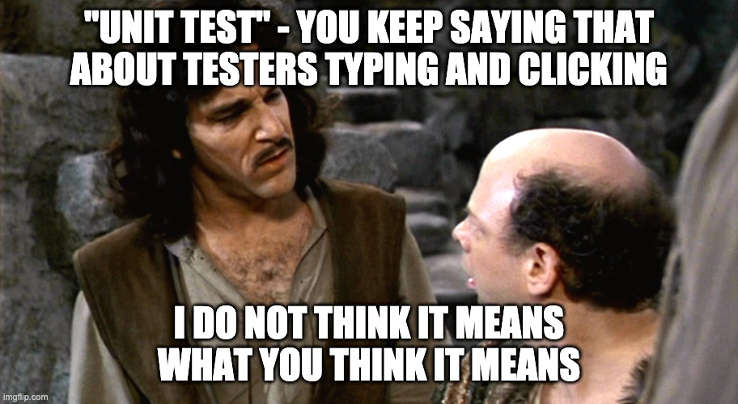

# Spring Demo Grocery POS*
#### *Point Of Sale System

## An executable, opinionated example of why, where, and how to write tests in a way that supports XP/Agile engineering practices.

This application is written in Spring Boot demonstrating best testing practices focused
on responsibilities of components by layers with an emphasis on highly performant unit testing.
This is a work in progress, but is responsibly broken down to focus on a simple classic MVC design
and testing with emphasis on component "unit" responsibilities.  Not testing in the UI what can be tested
at the service level, not testing at the service level what can be tested at the unit level.


Here's the main thing to understand about testing if don't want to create legacy code:

Do this:


Not this:


Why?  Simple:


Unit Tests should each run in 10s of milliseconds of real time (RAM/CPU activity), years in comparison to human scale. 

Integration tests typically hit network and/or disk IO, think decades or centuries in human comparison.

UI tests are closer to millenia in human scale.

If you think in that comparison, where do you want to focus your time testing as a system 
continues to grow and change?


## Sounds easy, but it's hard.  Let's start with some definitions:



## Some Testing Definitions
### Unit Test
A test that executes rapidly, using only CPU and RAM.  Can easily be run concurrently on multiple
CPU threads if configured properly.  The IDEAL location for business logic. 

### Integration/Service Test 
Some levels of work have to be done to provide service outside of pure RAM and CPU of course.  This typically 
falls to the realm of external web services, databases and the like.  These typically involve using a stubbed service 
and exercising more of the application stack (e.g. database layer testing, restful client testing).

### UI Tests
UI Tests simulate the full activity of a user using the system.  In the case of many web based applications, that
means starting up a web browser and directing it to simulate user activity.


## The 'Hello, POS system!'
### The example
This example system is a [Java 11](https://openjdk.java.net/projects/jdk/11/) 
[Spring Boot](https://spring.io/projects/spring-boot) 
[WebMVC](https://spring.io/guides/gs/serving-web-content/) 
application using [PostgreSQL](https://www.postgresql.org/) database,
[JDBI](https://jdbi.org) declarative relational database library, 
[Flyway](https://flywaydb.org/) database migration system, and 
[Freemarker](https://freemarker.apache.org/) view templates.

### The opinions
Here's a few of the opinions that drove my selection of the various technologies to demo:
1. Java 11 - It's Java, a good solid OO language and version 11 is a LTS versions (I'm using OpenJDK
   for my own political satisfaction)
1. Spring Boot - I've been a fan of Spring since before 'Boot' was around.  It's an expandable
set of tools to build network based applications on.
1. Spring WebMVC - The frontend world is the same old hot mess today as it's always been.  In 
   order to get a good feel for learning testing strategies, I wanted to keep this example simple.    
1. PostgreSQL - I wanted open source SQL and I just like it better than MySQL.  Sue me.
1. JDBI 3 - After all my years fighting ORM systems you will *NOT* convince me to use one 
   of my own free will.  Do yourself a favor and read [this](https://blog.codinghorror.com/object-relational-mapping-is-the-vietnam-of-computer-science/).
1. Flyway - I've used Liquibase, I just like Flyway better.  Don't do SQL based projects w/o a DB migration tool.
1. Freemarker - Your UI layer in MVC should be simple & stupid.  Freemarker is dumb in a good way,
making it easy to push what might be UI edge cases down to faster running integration tests. 

### The Tests

This demonstration has focused on Unit Testing in the following way:
1. Object level responsibilities for Spring Controllers & Services using:
   1. JUnit 5 tests with concurrent test execution enabled
   1. Fake objects for readability as opposed to mocking frameworks
1. Integration level responsibilities for Spring Repositories and View Templates using:
    1. SpringBootTest for Templates - using the same template engine to validate view 
    behavior without the overhead of full UI tests
    1. Docker [Testcontainers](https://www.testcontainers.org/) for Database Integration - a full PostgreSQL database 
       container for tests used exactly as would be for development and production.
1. UI level responsibilities for End to End testing using:
    1. Docker Testcontainers as above for database
    1. Docker Testcontainers for isolated Selenium Web Driver w/ Chromium web browser


## Setup and use notes
Development/build requires a local PostgreSQL database configured and running.

## This is still a bit of a work in progress
I'm putting this out there to show and tell.  I may or may not put some upgrades into it.

## Future goals (if I get around to them)
1. Full build on GitHub Actions, just to be cool
1. Clean up the TestSuites and/or isolate unit from integration/service & UI better
1. Pin down the various dependency versions in build.gradle (it's a bit TOO casual right now)
1. Put some dorky CSS coloring and imaging on it
1. Better documentation
1. I'm usually not a fan of comments, but since the purpose is to demonstrate XP testing
   and design concepts, I should probably "speak up" a bit inline.
1. Clean it up enough to use it as a base for an XP Lab with a set of customer stories 
to drive functionality.


## Current setup
1. JDK 11
1. You'll need to have Docker installed and working
1. PostgreSQL configured as indicated (or changed) here:

```shell
src/main/resources/config/application-local.yml
```

## Warnings
I've only tested/run this on MacOS.  It should work with properly configured Linux or 
Windows.  If you have any success/failures with it, feel free to drop me a note. 

## Some credits: 
1. https://martinfowler.com/bliki/TestPyramid.html
1. https://willowtreeapps.com/ideas/test-early-test-often-automation-testing-with-the-test-pyramid    
1. https://formulusblack.com/blog/compute-performance-distance-of-data-as-a-measure-of-latency/   
1. https://rieckpil.de/spring-boot-functional-tests-with-selenium-and-testcontainers/ 
